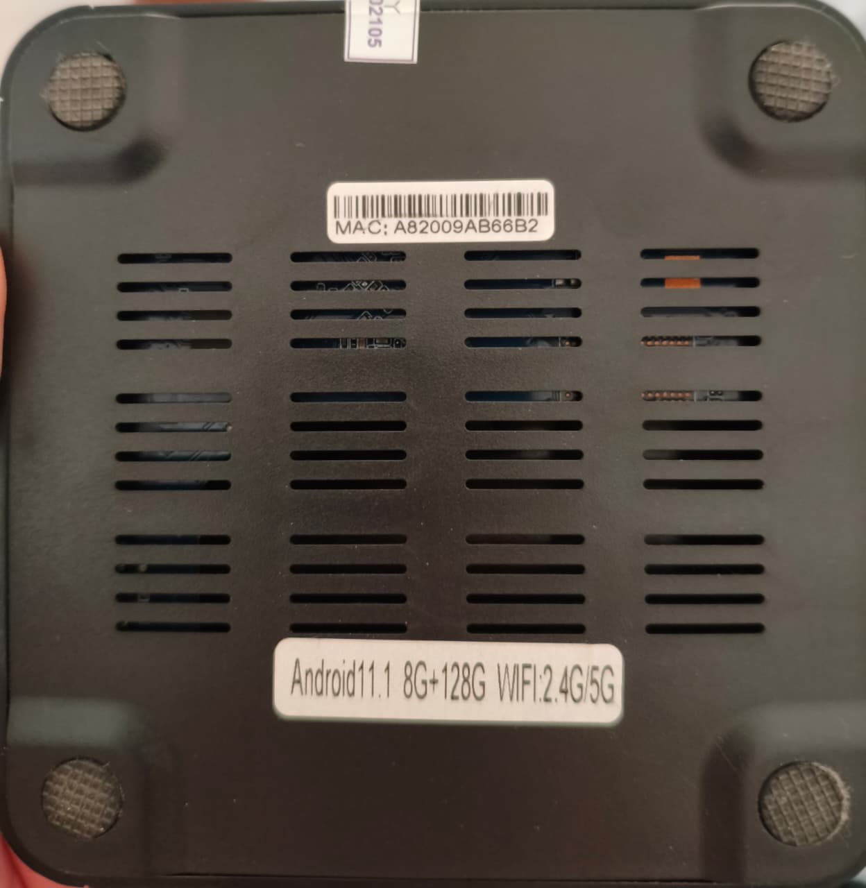
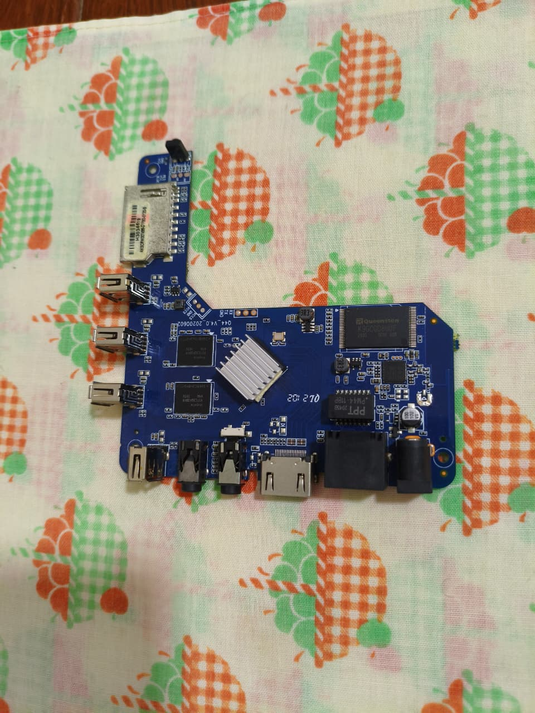
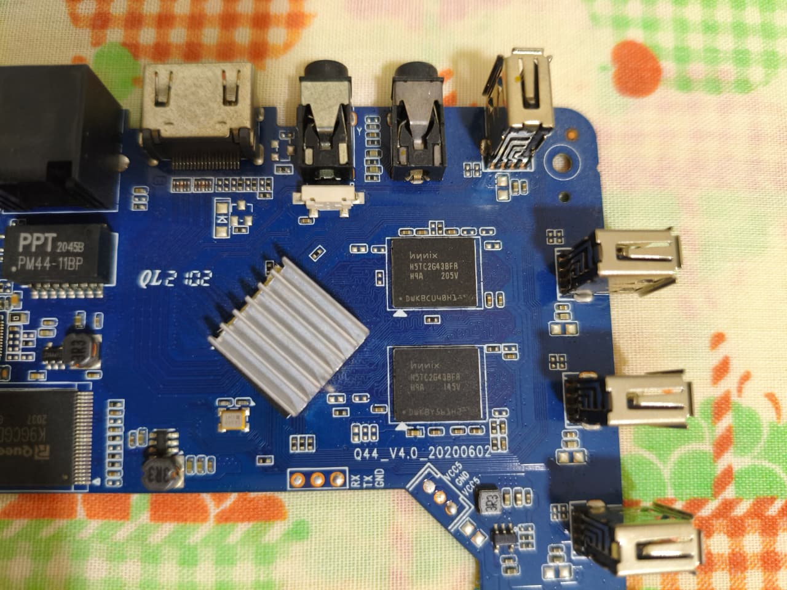
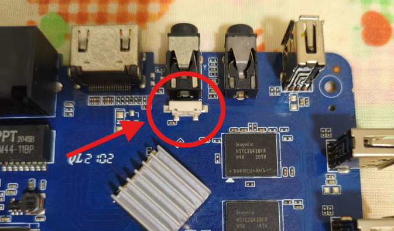

# mxq-pro-allwinner-h3-linux
Transforming an MXQ Pro TV Box (Allwinner H3 chip) into an Armbian Linux server.

# Project: ARM Development Station 🚀
### Hardware Reverse Engineering & Linux Porting

I started this project to repurpose a generic "MXQ Pro 4K" Android Box into a low-level learning station for ARM Assembly and C programming. This repository documents the journey from a locked Android device to a functional Linux ARM Server.

---

## 🔍 Phase 1: Hardware Identification (Completed)
After disassembling the unit, I discovered that the technical specifications printed on the box were misleading. Here is the actual hardware found inside:

* **SoC:** Allwinner H3 (Quad-core ARM Cortex-A7)
* **RAM:** 1GB DDR3 (SK hynix)
* **Internal Storage:** 8GB eMMC (Queenston)
* **Board Model:** Q44_V4.0_20200602
* **Current OS:** Armbian 26.2.0 (Kernel 6.18.20)

---

## 🛠️ Phase 2: The Boot Breakthrough
The main challenge was bypassing the stock Android OS to boot from a 128GB MicroSD card. 

### The "Secret Sauce" (Hardware Timing):
Through trial and error, I discovered a specific timing requirement for this board revision:
1.  Connect the power cable **first**.
2.  **Immediately** press the reset button (inside the AV port).
3.  This interrupts the standard bootloader at the exact millisecond the Allwinner H3 scans the SD slot.

---

## ⚙️ Setup Configuration
* **Image:** Armbian XFCE (Developer Preview)
* **Flashing Tool:** Rufus (MBR Partition Scheme)
* **Locale:** pt_BR.UTF-8
* **Timezone:** America/Fortaleza

---

### 🖼️ Project Gallery

Below are the visual milestones of this project:

### 1. The misleading specifications printed on the case

### 2. The real board inside (Engineering Truth)

### 3. Allwinner H3 SoC Detail

### 4. The AV port hiding the crucial reset button

---

## 💾 Installation Media (Verified Build)
After testing several versions, this specific build proved to be the most stable for this hardware revision. You can download it below:

* **System Image:** `Armbian_26.2.0_X96q_xfce_trunk_6.18.20.img.xz`
* **Direct Download:** [🚀 Download Armbian Image](https://github.com/seu-usuario/mxq-pro-allwinner-h3-linux/releases/download/v1.0.0/Armbian_26.2.0_X96q_xfce_trunk_6.18.20.img.xz)
* **Flashing Tool:** [Rufus](https://rufus.ie/) (Use MBR partition scheme)

> **Pro Tip:** This image includes the XFCE desktop environment, making it a complete "ARM Development Station" right out of the box.

---
*Status: Phase 2 - OS Installation & Configuration (Successful) ✅*
*Next Steps: Studying OS architecture and network protocols.*
